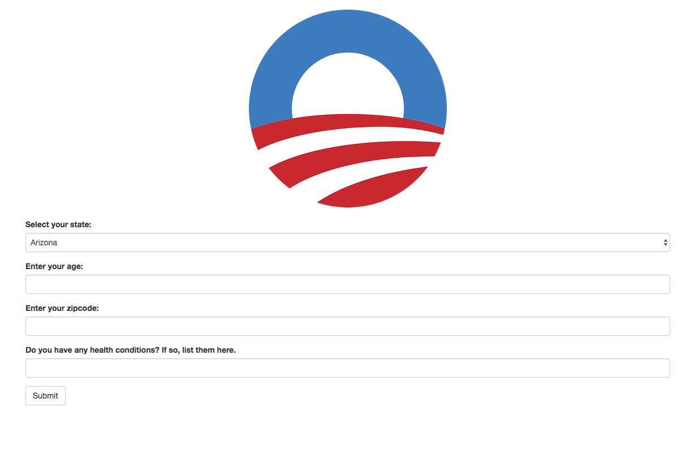

# Flask Backend

### Elasticsearch
Set up elasticsearch on an AWS EC2 instance:

    sudo rpm --import https://packages.elastic.co/GPG-KEY-elasticsearch

Paste into `/etc/yum.repos.d/elasticsearch.repo`:

    [elasticsearch-2.x]
    name=Elasticsearch repository for 2.x packages
    baseurl=https://packages.elastic.co/elasticsearch/2.x/centos
    gpgcheck=1
    gpgkey=https://packages.elastic.co/GPG-KEY-elasticsearch
    enabled=1

Install elasticsearch:

    sudo yum install elasticsearch

Install the elasticsearch-readonlyrest-plugin

    sudo /usr/share/elasticsearch/bin/plugin install https://github.com/sscarduzio/elasticsearch-readonlyrest-plugin/blob/master/download/elasticsearch-readonlyrest-v1.9.3_es-v2.3.3.zip?raw=true

Paste the following settings into `config/elasticsearch.yml`:

    network.host: 0.0.0.0
    http.cors.enabled : true
    http.cors.allow-origin : "*"
    readonlyrest:
        enable: true
        response_if_req_forbidden: Sorry, your request is forbidden.
        access_control_rules:

        - name: Accept all requests from localhost
          type: allow
          hosts: [127.0.0.1]

        - name: Just certain indices, and read only
          type: allow
          actions: ["cluster:*", "indices:data/read/*"]
          indices: ["<no-index>", "data"] # index aliases are taken in account!

### Load data

Load the data into elasticsearch first using `simulate_plans_data.ipynb`.  

Create tables on AWS RDS PostgreSQL database:

    psql --host=$RDS_HOSTNAME --port=5432 --username=$RDS_USERNAME --password --dbname=$RDS_DB_NAME --file=schema.sql

### Elastic Beanstalk
Initiate and create environment:

    eb init -i
    eb create aca-flask

Set environment variables: `FLASK_CONFIG`, `SECRET_KEY`, `RDS_DB_NAME`, `RDS_USERNAME`, `RDS_PASSWORD`, `RDS_HOSTNAME`  

Add RDS's security group to EB

#### Home Page

The user selects their state from a dropdown menu. They can also enter a query that will be parsed and used to filter results. The data is logged in a sqlite database with a unique session id.

#### Results Page

The user can search and filter the list of returned plans. The clickstream data is sent back to the Flask server and saved in the sqlite database.
